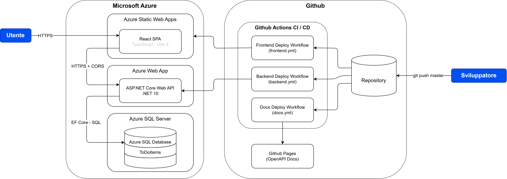

# ToDoListApp

ToDoListApp è un'applicazione web che permette ad una persona o ad un team di tenere traccia delle attività da svolgere.

## Features

L'applicazione permette di eseguire diverse operazioni su una lista di attività inserite dagli utenti:

* Visualizzare le attività inserite;
* Creare una nuova attività;
* Modificare le informazioni relative ad un'attività già esistente;
* Segnalare un'attività come completa o incompleta;
* Eliminare un'attività dell'elenco.

## Link Utili
Di seguito trovate i link per accedere ai vari componenti del progetto:

* [Frontend](https://happy-field-00298b810.7.azurestaticapps.net)
* [Backend](https://app-todolistapp-prod-g6dmdzhxb5aheabj.italynorth-01.azurewebsites.net/) 
* [Documentazione backend](https://l3llo.github.io/ToDoListApp/#tag/todoitems) 

## Architettura

L'architettura dell'applicazione si sviluppa secondo le indicazioni ricevute nella consegna. La scelta è ricaduta sull'archiettura consigliata in modo tale da ottimizzare il tempo a mia disposizione per lo sviluppo dell'applicazione. I principali componenti dell'architettura sono:

* **Frontend**: React SPA (Typescript - Vite 8)
* **Backend**: ASP.NET Core Web API (.NET 10)
* **Persistenza e Hosting**: Microsoft Azure (Azure Static Web Apps - Azure Web App - Azure SQL Server) 
* **Versionamento** del codice: Github 
* **Pipeline CI / CD**: Github Actions

### Frontend

Il progetto di backend è strutturato secondo lo schema architetturale Model-View-ViewModel. Ho deciso di utilizzare typescript in quanto l'implementazione del type-safe lo rende più in linea con il backend C# rispetto a Javascript tradizionale in cui non ci sono vincoli di tipo. L'applicazione implementa una semplice interfaccia che permette di effettuare le operazioni CRUD. Essendo che non era richiesta una grafica avanzata mi sono limitato a rendere ben impaginato il contenuto, preoccupandomi di garantire una corretta leggiblità anche nel caso di utilizzo da dispositivi mobile.

### Backend

Il progetto di backend è strutturato secondo i principi della clean architecture, ma in una versione semplificata: al posto che avere 4-5 progetti diversi che descrivono i vari layer del modello, ho pensato di traslare questo compito tramite l'utilizzo di cartelle. Questa scelta deriva dalla bassa complessità operativa dell'applicazione, e ho preferito evitare la creazione di molteplici progetti praticamente vuoti. La struttura a cartelle, per come si presenta, è facilmente convertibile in un modello clean architecture classico: è sufficiente prendere le cartelle e trasformarle in progetti a se stanti e aggiungere le dipendenze necessarie e i riferimenti tra progetti. I modelli dei dati provenienti dal database vengono gestiti tramite Entity Framework Core, che tramite un approccio code-first mi ha permesso di definire prima i modelli in C#, per poi andare a traslarli sia sul db locale (utilizzato in fase di testing inziale per non sprecare i limiti di utilizzo di Azure) che sul db instanziato su Azure. La migrazione avviene a runtime, in modo tale che non debba essere eseguita tramite la pipeline.

### Persistenza e Hosting

La piattaforma su cui vengono gestite persistenza e hosting è Microsoft Azure. Dopo aver compreso le varie opzioni a mia disposizione, ho optato per l'utilizzo delle seguenti tecnologie:

* **Azure Static Web Apps**: utilizzato per l'hosting dell'applicazione frontend del progetto. Ho deciso di utilizzare questo prodotto in quanto permette un setup facile di un'applicazione frontend tramite l'integrazione automatica con Github e la conseguente creazione automatica di una pipeline di distribuzione;
* **Azure Web App**: utilizzato per l'hosting del backend. A differenza di Azure Static Web Apps, non è possibile creare una pipeline di distribuzione automaticamente, ma l'implementazione di quest'ultima non è stata particolarmente difficile. Essendo che l'applicazione di backend, come del resto tutto il progetto, non aveva un'alta complessità logica, ho deciso di utilizzare questo prodotto Azure in quanto il setup è relativamente immediato.
* **Azure SQL Server**: utilizzato per gestire la persistenza dei dati. Dopo aver creato un'istanza SQL Server, sonno andato a creare un Azure SQL database, necessario per la migrazione dello schema db generato da EF Core.

Tutte le risorse azure utilizzate sono state racchiuse in un gruppo di risorse in modo tale da averle tutte sotto controllo nello stesso posto.

### Versionamento del codice

Ho deciso di utilizzare github in quanto ho familiarità con la piattaforma. Oltre al branch master presente di default, ho pensato di creare ulteriori due branche dedicati all'implementazione delle funzionalità lato backend e frontend, in modo da tenere il branch master pronto per l'ambiente di produzione.

### Pipeline CI/CD

Per la gestione del deploy, ho utilizzato Github Actions. In particolare, mi sono servito di 3 diverse pipeline per eseguire i vari deploy necessari:
 
 * **frontend.yml**: Utilizzata per eseguire il deploy. Questa pipeline è stata generata qutomaticamente da azure in fase di creazione della Static Web App. La pipeline prevede l'esecuzione dell'azioni di build e deploy che permettono di pubblicare l'applicazione su Azure;
 * **backend.yml**: Utilizzata per eseguire il deploy del backend. La pipeline prevede l'esecuzione dell'azione di deploy tramite gli step di checkout, di setup dell'ambiente .NET, di publish dell'applicazione e infine di deploy su Azure;
 * **docs.yml**: Utilizzata per eseguire il deploy della documentazione del backend. La pipeline prevede l'esecuzione dell'azione di deploy tramite gli step di checkout, di setup dell'ambiente .NET, di build per generare il file openapi.json utilizzato da Scalar, di preparazione del sito tramite il file index.html, di upload dell'artefatto e infine di deploy su Github Pages.

Tutte le pipeline vengono eseguite al momento del push sul branch master, in modo da non effettuare la pubblicazione dell'applicazione o della documentazione anche al push sui var branch del repository.

## Limiti noti

I principali limiti riguardano l'utilizzo delle risorse Azure: essendo che sto utilizzando una sottoscrizione gratuita, i servizi relativi a database e app backend sono vincolati all'ibernazione quando non in uso, e quindi al primo avvio dopo un po' di tempo i tempi di caricamento potrebbero esseri lunghi.

## Possibili evoluzioni future

Il naturale prossimo passo di sviluppo sarebbe l'implementazione della logica di autenticazione utenti: allo stato attuale, l'applicazione permette di consultare un singolo elenco di attività per tutti. L'aggiunta di un sistema di autenticazione permetterebbe di mantenere separate le liste per ogni utente.

Un altro possibile sviluppo potrebbe essere quello di condividere le liste di note tra utenti, in modo che un gruppo di utentu possa accedere ad uno stesso elenco: questo richiederebbe l'autenticazione utente, oltre all'aggiunta di informazioni extra relative al creatore delle attività ad ognuna di esse.

Con l'ingrandirsi dell'applicazione e con l'aumentare della complessità logica della stessa, sarebbe utile mantenere una suite di unit test e integration test, in modo da rendere meno dipendente dagli errori degli sviluppatori il corretto funzionamento dell'applicazione dopo aggiornamenti delle funzionalità.

